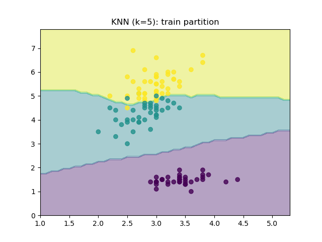
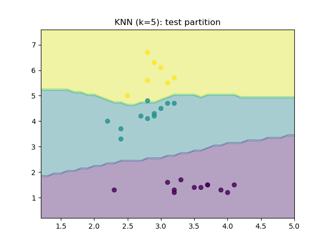

# Non Parametric Modeling (KNN)

Code for K-Nearest Neighbor algorithm (a non-parametric modeling technique)

---

## Theory

Please note that the theory corresponding to the codes is hosted on [link](https://parag1604.github.io/notes/Machine-Learning/Non-parametric-Models)

## Python Environment Setup

Ensure the following is installed in your python environment:

- Numpy - required for vectorized operations
- Scikit-learn - For loading the IRIS dataset
- Matploitlib - required for plotting

## KNN

Execute the following to get a classification model using the K-Nearest Neighbor algorithm:

```bash
python main.py <k>
```

After training, you should get plots like the following:
Train             |  &nbsp;Test&nbsp;
:-------------------------:|:-------------------------:
  |  

The accuracy on the test split should be >95%:

```bash
$ python main.py 5
Test Accuracy: 0.967
```

Experiment with various values of `k`
